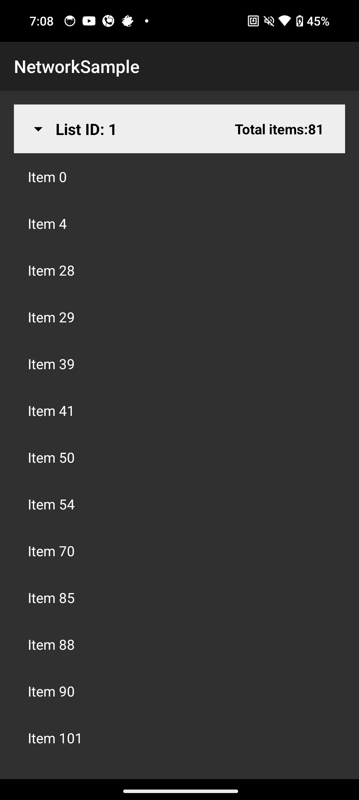
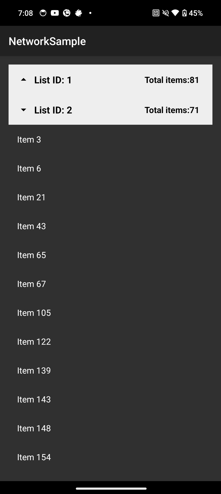
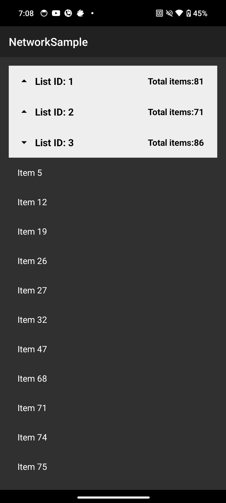
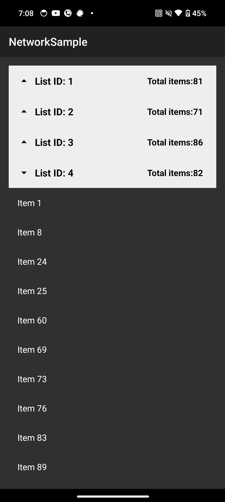
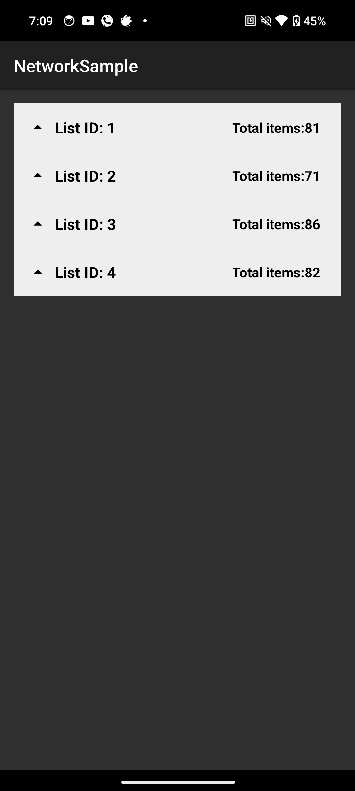

## Network Sample
This sample uses `MVVM` with `Clean architecture` to fetch data from the specified URL using 
`Retrofit`.

### Sorting
Items are grouped by `listId`, then sorted by `listId` and then by `name`. Since `name` of each item
starts with "Item ", numeric values of `Item` was used for sorting

### Enhancements
- Output is enhanced by using collapsible view to view data for each `listId`
- Also, total count of items are displayed for each `listId`

### Output Screenshots

